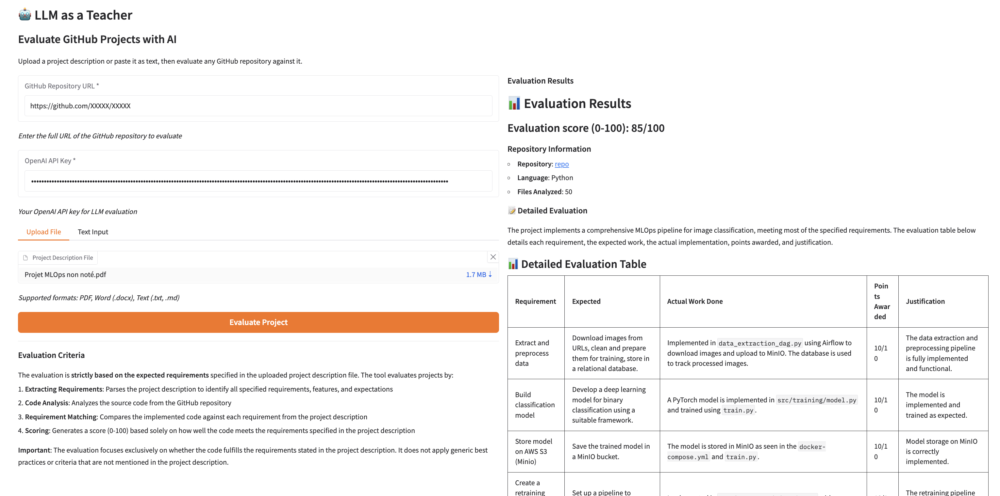

# LLM as a Teacher - GitHub Project Evaluator

An intelligent tool that uses Large Language Models (LLMs) to evaluate student GitHub projects against project descriptions. The tool analyzes source code and provides a score (0-100) with detailed explanations.

## Features

- 📄 **Multiple File Format Support**: Parse project descriptions from PDF, Word (.docx), or plain text files
- 🔍 **GitHub Integration**: Access repositories via GitHub API or by cloning
- 🤖 **LLM-Powered Evaluation**: Uses OpenAI's GPT models to evaluate code quality and completeness
- 📊 **Detailed Scoring**: Provides scores from 0-100 with comprehensive explanations
- 🎯 **Comprehensive Analysis**: Evaluates functionality, code quality, completeness, architecture, and documentation

## Screenshot



*Interface de l'application web montrant l'évaluation d'un projet GitHub avec un score de 85/100, les informations du dépôt, et une analyse détaillée des forces, faiblesses et fonctionnalités manquantes.*

## Installation

### Prerequisites

- Python 3.8 or higher
- [uv](https://github.com/astral-sh/uv) - Fast Python package installer and resolver

Install uv:
```bash
curl -LsSf https://astral.sh/uv/install.sh | sh
```

Or using pip:
```bash
pip install uv
```

### Setup

1. Clone this repository:
```bash
git clone https://github.com/martin-prillard/llm-as-a-teacher.git
cd llm-as-a-teacher
```

2. Install dependencies and create virtual environment:
```bash
uv sync
```

This will automatically:
- Create a virtual environment
- Install all dependencies from `pyproject.toml`
- Set up the project for development

3. Set up your OpenAI API key:
```bash
export OPENAI_API_KEY="your-api-key-here"
```

Or optionally set a GitHub token for better API access:
```bash
export GITHUB_TOKEN="your-github-token-here"
```

## Usage

### Web Application (Recommended)

The easiest way to use the tool is through the Gradio web interface:

**Quick Start:**
```bash
./run.sh
```

Or manually:

1. Start the Gradio web server:
```bash
uv run python app.py
```

2. Open your browser and navigate to:
```
http://localhost:7860
```

3. Fill in the form:
   - Enter the GitHub repository URL
   - Provide your OpenAI API key (or set `OPENAI_API_KEY` environment variable)
   - Upload a project description file OR paste the description text
   - Click "Evaluate Project"

4. View the results with score, explanation, and detailed analysis

**Custom port:**
```bash
PORT=8080 uv run python app.py
```

**Share the interface publicly:**
```bash
GRADIO_SHARE=true uv run python app.py
```

### Command Line Interface

For command-line usage:

```bash
uv run python main.py <git_url> <description_file> [options]
```

**Examples:**

Evaluate a repository with a PDF description:
```bash
uv run python main.py https://github.com/user/project.git project_description.pdf
```

Evaluate with a Word document:
```bash
uv run python main.py https://github.com/user/project.git description.docx --output report.txt
```

Evaluate with a text file:
```bash
uv run python main.py https://github.com/user/project.git description.txt --api-key sk-...
```

**Command Line Arguments:**

- `git_url`: URL of the GitHub repository to evaluate (required)
- `description_file`: Path to the project description file (PDF, Word, or text) (required)
- `--output`: Optional path to save the evaluation report
- `--api-key`: OpenAI API key (optional if `OPENAI_API_KEY` env var is set)

## Evaluation Criteria

The evaluation is **strictly based on the expected requirements** specified in the uploaded project description file. The tool evaluates projects by:

1. **Extracting Requirements**: Parses the project description to identify all specified requirements, features, and expectations
2. **Code Analysis**: Analyzes the source code from the GitHub repository
3. **Requirement Matching**: Compares the implemented code against each requirement from the project description
4. **Scoring**: Generates a score (0-100) based solely on how well the code meets the requirements specified in the project description

**Important**: The evaluation focuses exclusively on whether the code fulfills the requirements stated in the project description. It does not apply generic best practices or criteria that are not mentioned in the project description.

## Project Structure

```
llm-as-a-teacher/
├── app.py            # Gradio web application
├── main.py           # CLI entry point
├── evaluator.py      # LLM-based evaluation logic
├── file_parser.py    # File parsing (PDF, Word, text)
├── git_handler.py    # GitHub repository access
├── pyproject.toml    # Project configuration and dependencies
├── run.sh            # Quick start script
├── README.md         # This file
└── .gitignore        # Git ignore rules
```

## Requirements

- Python 3.8+
- [uv](https://github.com/astral-sh/uv) - Python package manager
- OpenAI API key
- Git (for cloning repositories if API access fails)
- Internet connection

## Supported File Formats

- **PDF**: `.pdf` files (requires `pdfplumber`)
- **Word**: `.docx`, `.doc` files (requires `python-docx`)
- **Text**: `.txt`, `.md` files

## Limitations

- Large repositories may be truncated (limited to ~50 files)
- Very large files may be truncated to 50KB
- Requires internet connection for LLM API calls
- GitHub API rate limits apply (60 requests/hour without token)

## Contributing

Contributions are welcome! Please feel free to submit a Pull Request.

## License

This project is open source and available under the MIT License.

## Author

Created as part of the LLM as a Teacher project.

